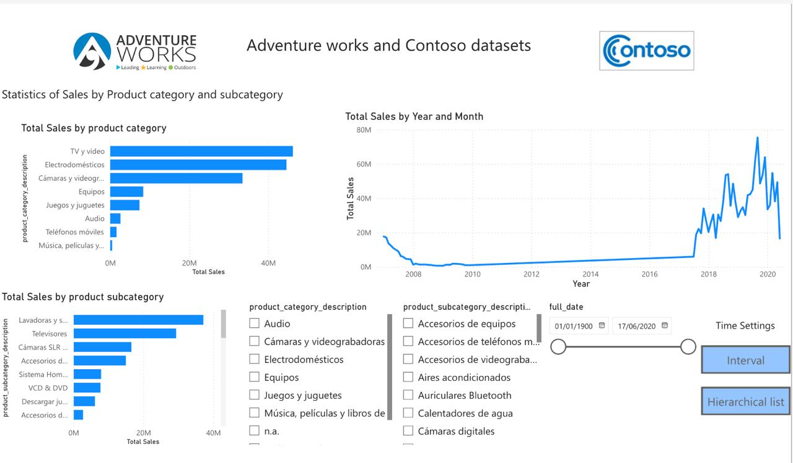
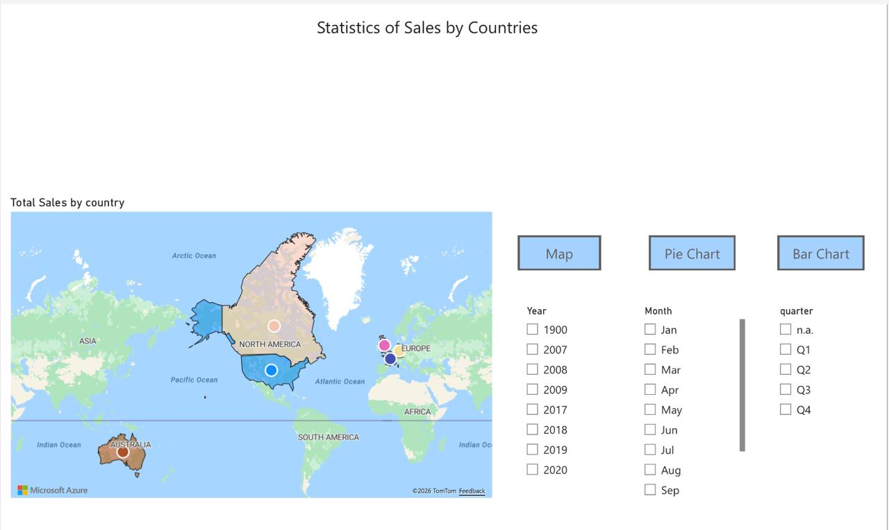
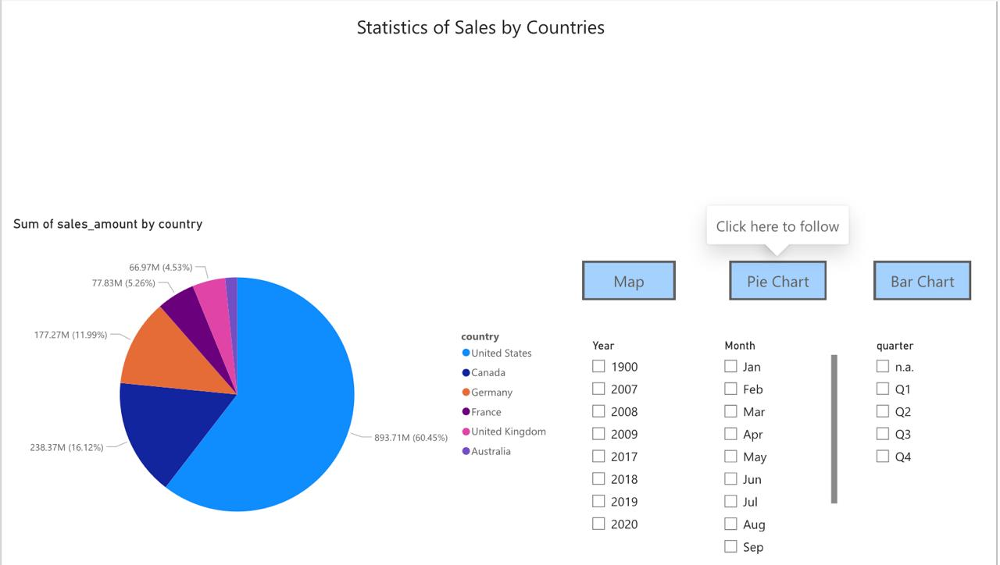
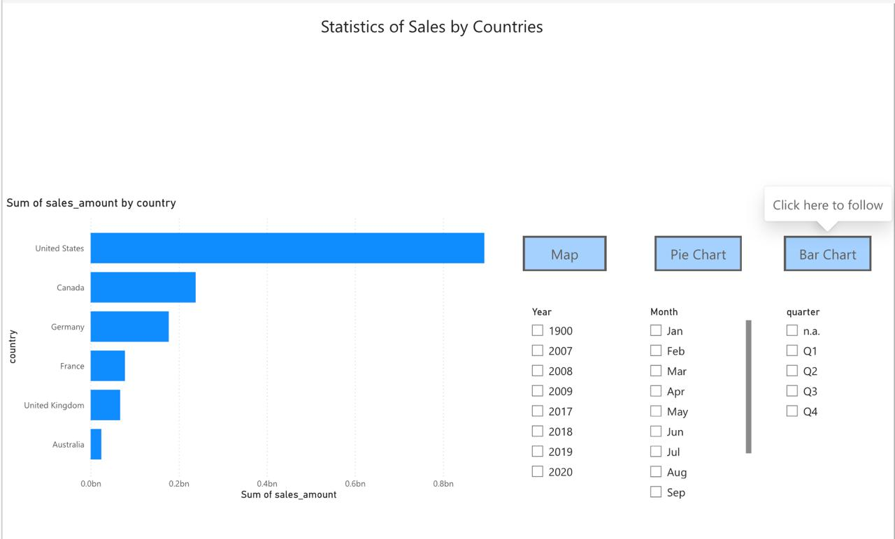
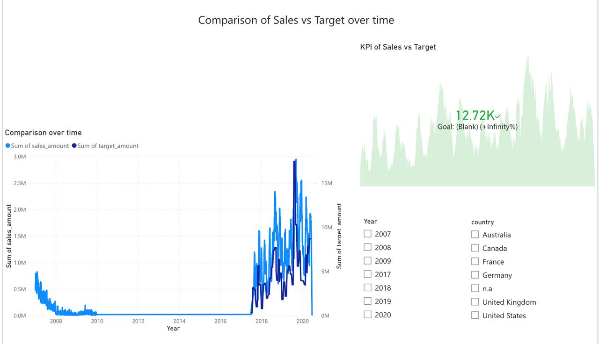

# Power-BI-Project
Created a Power BI report on Adventure Works and Contoso Datasets using previously created Data warehouse. Made lots of visualization for business purposes and implemeted some Power BI features in learning purposes. 

Also, uploaded the documentation file for the project, showing each step of creating visualizations and reasoning.

## Useful Project Links
The drive link for pbix file: https://drive.google.com/drive/folders/19mOeAB-pjv7BwSduCWgjrVB3t37LKLk8?usp=drive_link

The link in Power BI service: https://app.powerbi.com/links/jZOs6S0v0Z?ctid=b41b72d0-4e9f-4c26-8a69-f949f367c91d&pbi_source=linkShare

## Pages of the report

